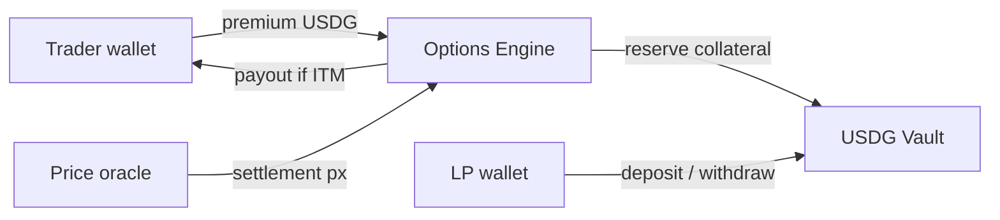

<div align="center">

# HoodOptions

**The options layer for tokenized stocks on Robinhood Chain.**

Max loss = premium. No liquidations. USDG in, USDG out.

[**hoodoptions.xyz**](https://hoodoptions.xyz) · [Docs](https://hoodoptions.xyz/docs) · [Trade](https://hoodoptions.xyz/trade) · [Earn](https://hoodoptions.xyz/earn)

-c4a574)


</div>

---

## What it is

Robinhood Chain put stocks on-chain. Nobody built the derivatives layer. HoodOptions is that layer:

- **UP / DOWN options** on tokenized stocks and RWAs (NVDA, TSLA, SPCX, …) with 2–10× payoff bands
- **Defined risk, always** — a trader's maximum loss is the premium paid, enforced by design. No margin, no liquidation engine, no funding rates
- **USDG vault** — LPs deposit USDG, collectively write every option, and earn the premium flow. ERC4626-style shares, 80% utilization cap
- **Real market data** — live quotes feed pricing and settlement

## Architecture



| Layer | Today | Next |
|---|---|---|
| Venue (UI, vault, positions, points) | Live at hoodoptions.xyz | — |
| Wallets | Robinhood Chain via wagmi/viem | Robinhood Wallet deep link |
| Prices | Live market feed, 30s refresh | Chainlink adapter |
| Settlement | Server engine (auditable ledger) | `HoodOptionsEngine.sol` on-chain |
| Contracts | Written, deploy-ready (`contracts/`) | Testnet → audit → mainnet |

## Run it

```bash
npm install
npm run dev          # http://localhost:3000
```

Production build: `npm run build && npm start`. Deploys to Vercel out of the box.

## Contracts

Foundry project in [`contracts/`](contracts/): `HoodVault.sol` (USDG liquidity vault), `HoodOptionsEngine.sol` (defined-risk options, oracle settlement), `USDGMock.sol` (testnet only).

```bash
cd contracts
forge script script/Deploy.s.sol --rpc-url robinhood_testnet \
  --private-key $DEPLOYER_KEY --broadcast
```

Networks: mainnet `4663` · testnet `46630` · explorer [robinhoodchain.blockscout.com](https://robinhoodchain.blockscout.com)

## API

| Endpoint | Purpose |
|---|---|
| `GET /api/health` | Venue heartbeat |
| `GET /api/state` | Venue + session snapshot |
| `GET /api/markets` · `GET /api/quote` | Markets and option quotes |
| `POST /api/trade` · `/deposit` · `/withdraw` · `/claim` | Trading + LP actions |
| `POST /api/wallet` | Bind a connected wallet to the session |

## Security model

- Trader downside is hard-capped at premium — structurally, not by liquidation
- Vault utilization capped at 80% so LP exits stay honest
- Mainnet gate: independent audit, Chainlink-compatible oracle, multisig + timelock on admin

## Roadmap

1. **Now** — live venue, real prices, wallet-native accounts
2. **Testnet** — contracts deployed, HOOD incentive claims for test users
3. **Mainnet** — audited contracts, canonical USDG, RWA market expansion (private-market tokens, ETFs)
