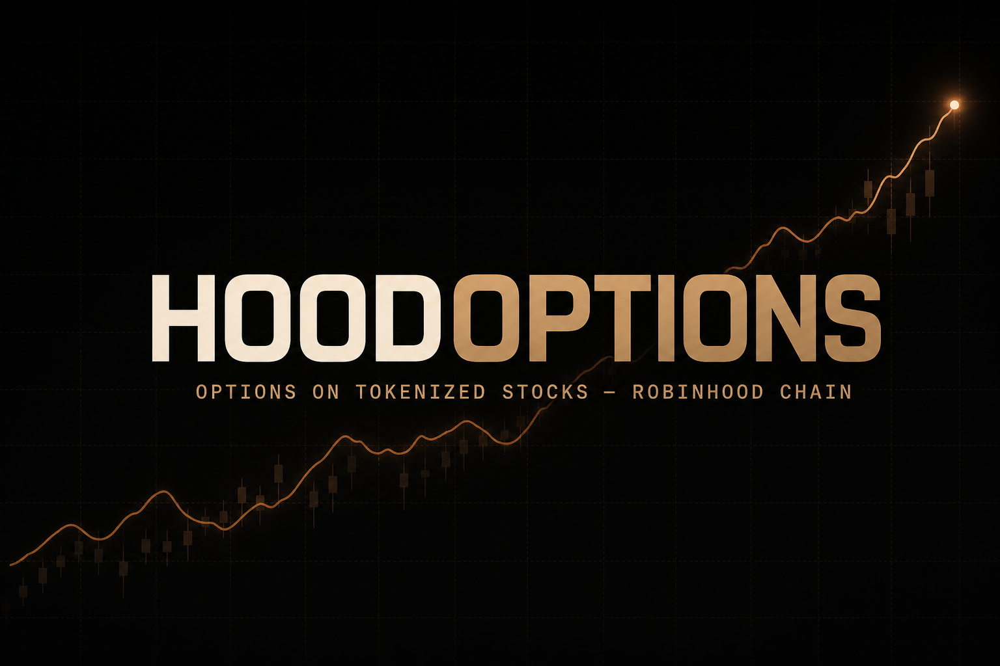
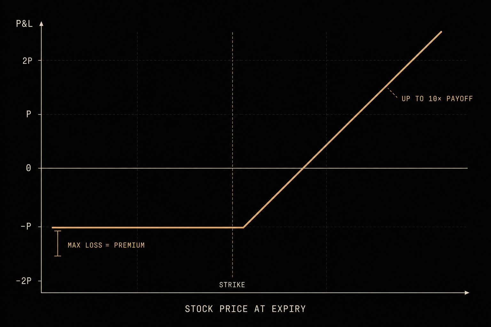
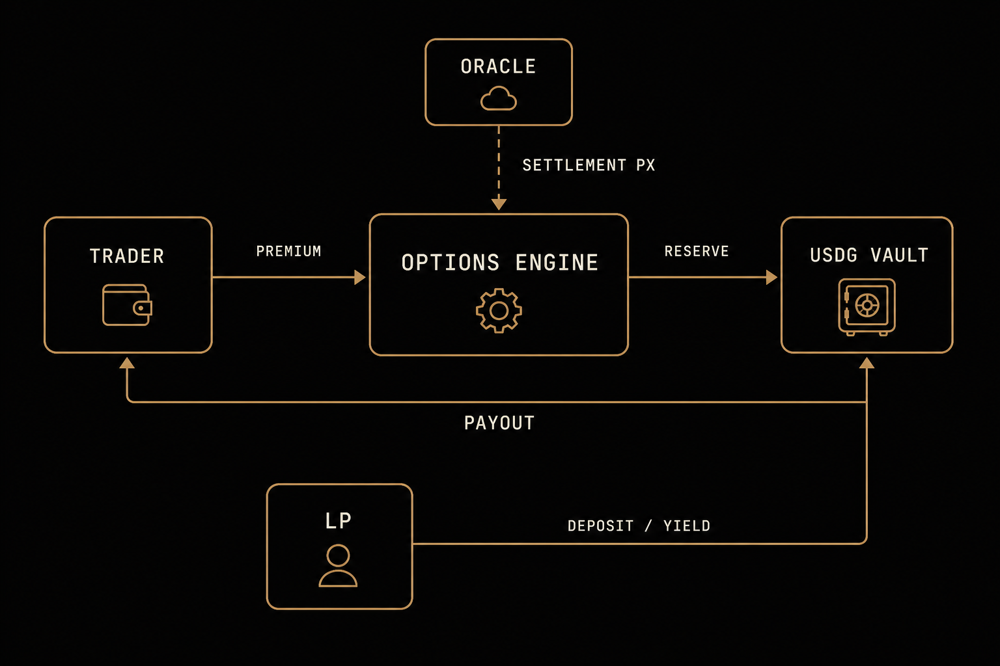
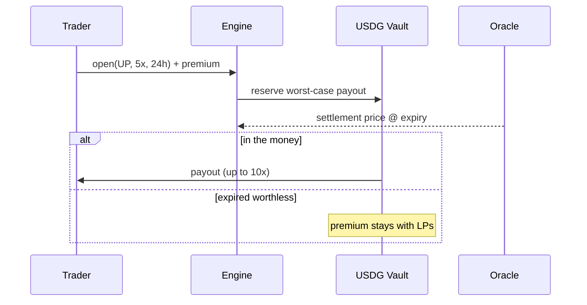

<div align="center">



### The options layer for tokenized stocks on Robinhood Chain

**Max loss = premium. No liquidations. USDG in, USDG out.**

[**→ hoodoptions.xyz**](https://hoodoptions.xyz)

[Trade](https://hoodoptions.xyz/trade) · [Earn](https://hoodoptions.xyz/earn) · [Board](https://hoodoptions.xyz/board) · [Docs](https://hoodoptions.xyz/docs) · [API](https://hoodoptions.xyz/api/health)


</div>

---

## Why this exists

Robinhood Chain put **stocks on-chain** — NVDA, TSLA, even private-market RWAs like SpaceX. What it doesn't have is a derivatives layer. Every serious market grows one; on Robinhood Chain, HoodOptions is it.

Perps liquidate people on wicks. We don't. Every position on HoodOptions is a **defined-risk option**: the trader pays a premium, and that premium is the absolute maximum they can lose. Structurally — not because a liquidation engine was merciful.



## How the money flows

Traders pay premiums into a shared **USDG vault**. LPs own the vault and collectively act as the counterparty to every option written. Premiums are LP yield; collateral for worst-case payouts is reserved at write time and capped at 80% utilization so LP withdrawals always stay honest.



## The venue, live

<div align="center">


</div>

| | |
|---|---|
| **UP / DOWN options** | 2–10× payoff bands on NVDA, TSLA, SPCX, AMD, AAPL, META, AMZN, PLTR |
| **Real market data** | Live quotes drive pricing and settlement, 30s refresh |
| **Wallet-native** | Connect on Robinhood Chain (4663 / testnet 46630), account follows the wallet |
| **USDG vault** | ERC4626-style shares, live share price, APY from premium flow |
| **Options board** | Deribit-style strike × expiry matrix |
| **Points + leaderboard** | Every trade and deposit earns points — future incentive allocation |

## Stack

```text
app/         Next.js 15 · Tailwind · Framer Motion · lightweight-charts
wallets/     wagmi · viem — Robinhood Chain mainnet + testnet
state/       shared venue engine, wallet-keyed accounts, live price feed
contracts/   Foundry — HoodVault.sol · HoodOptionsEngine.sol · USDGMock.sol
```



## Run it

```bash
npm install && npm run dev     # http://localhost:3000
```

Deploy contracts to Robinhood testnet:

```bash
cd contracts
forge script script/Deploy.s.sol --rpc-url robinhood_testnet \
  --private-key $DEPLOYER_KEY --broadcast
```

## Status — honest by design

| Layer | Today | Next |
|---|---|---|
| Venue (UI, vault, positions, points) | **Live** at hoodoptions.xyz | — |
| Wallets | **Live** — Robinhood Chain via wagmi | Robinhood Wallet deep link |
| Market data | **Live** — real quotes | Chainlink adapter |
| Settlement | Server engine, auditable ledger | `HoodOptionsEngine.sol` on-chain |
| Contracts | Written, deploy-ready | Testnet → audit → mainnet |

**Mainnet gate:** independent audit · Chainlink-compatible oracle · multisig + timelock on admin · canonical USDG.

## API

| Endpoint | Purpose |
|---|---|
| `GET /api/health` | Venue heartbeat |
| `GET /api/state` | Venue + session snapshot |
| `GET /api/markets` · `GET /api/quote` | Markets and option quotes |
| `POST /api/trade` · `/deposit` · `/withdraw` · `/claim` | Trading + LP actions |
| `POST /api/wallet` | Bind a connected wallet to the session |

---

<div align="center">

**[hoodoptions.xyz](https://hoodoptions.xyz)** — options on the stocks that just moved on-chain.

</div>
